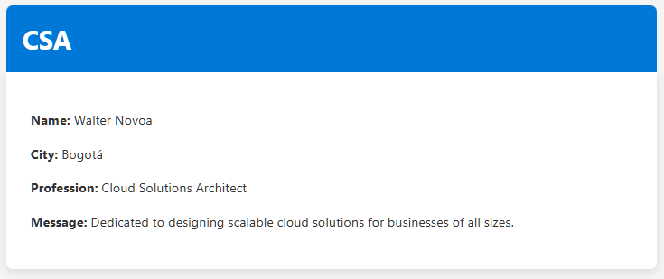
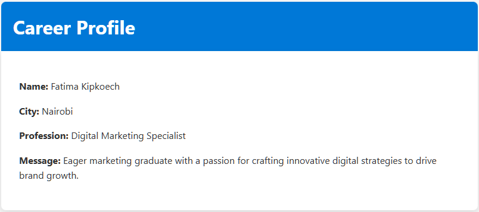
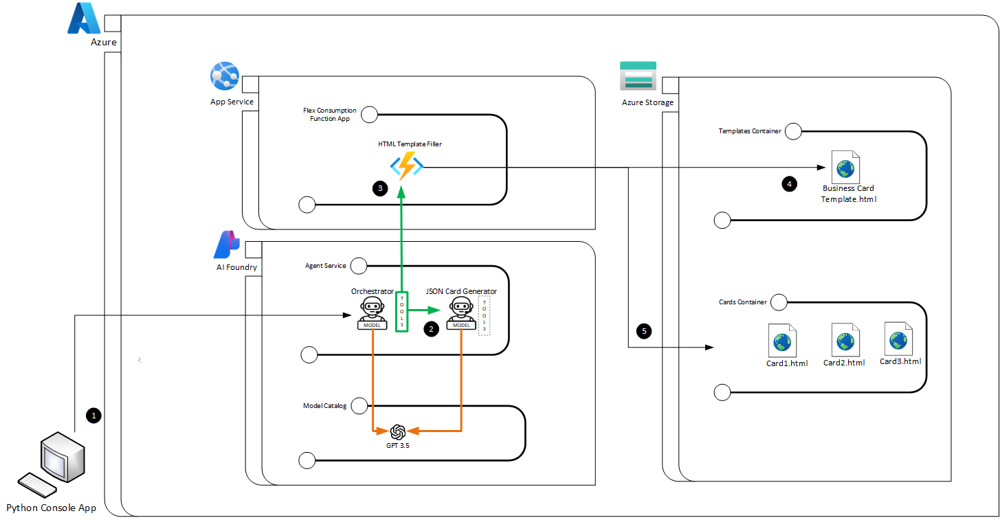
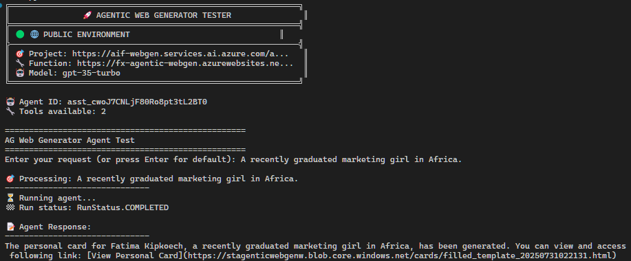

# Agentic Web Generator on Azure AI Foundry

This repository provides a hands-on implementation of a multi-agent system built with **Azure AI Foundry**, demonstrating how intelligent agents can be orchestrated to generate and publish personalized business cards as web pages, starting from natural language input.

---

## Table of Contents

- [Agentic Web Generator on Azure AI Foundry](#agentic-web-generator-on-azure-ai-foundry)
  - [Table of Contents](#table-of-contents)
  - [Project Overview](#project-overview)
  - [What You'll Learn](#what-youll-learn)
  - [Architecture](#architecture)
    - [Execution Flow](#execution-flow)
    - [Visual Highlights in the Diagram](#visual-highlights-in-the-diagram)
  - [Installation \& Requirements](#installation--requirements)
    - [Prerequisites](#prerequisites)
    - [Recommended VSCode Extensions](#recommended-vscode-extensions)
    - [Quick Windows Setup](#quick-windows-setup)
  - [Solution Setup](#solution-setup)
    - [Deploy Azure Required Components](#deploy-azure-required-components)
    - [Configure Deployed Services](#configure-deployed-services)
      - [Azure Storage](#azure-storage)
      - [Azure Function](#azure-function)
      - [Azure AI Foundry](#azure-ai-foundry)
  - [Clone the code and start coding!](#clone-the-code-and-start-coding)
    - [Folder Structure](#folder-structure)
      - [Key Components Explained](#key-components-explained)
        - [🐍 **agent-webmaster-py/**](#-agent-webmaster-py)
        - [⚡ **AgenticWebGen.DotNetTools/**](#-agenticwebgendotnettools)
        - [🏗️ **infra/**](#️-infra)
        - [🔧 **requests/**](#-requests)
        - [🌐 **webapp/**](#-webapp)
        - [📦 **misc/**](#-misc)
    - [Setting Up the Environment](#setting-up-the-environment)
      - [Azure Function (FxTemplateFiller - C#)](#azure-function-fxtemplatefiller---c)
      - [Agents Application (Python Console App)](#agents-application-python-console-app)
        - [Card Generator Agent Testing](#card-generator-agent-testing)
        - [Orchestrator Agent Testing](#orchestrator-agent-testing)
---

## Project Overview

This application demonstrates a **multi-agent architecture** where the user interacts through a Python console app to request the creation of a business card for a given person. The user can provide full or partial data (name, profession, location, etc.), and the agents will intelligently complete the rest and generate a realistic business card.

The final output is a **web-based HTML card** hosted on Azure Blob Storage.

For example, given this input to the application:
```plain text
Please generate an online business card for Walter Novoa. A Cloud Solutions Architect from Colombia. The title should be CSA.
```
The system will generate a business card with the provided details and will publish in a public URL with a content like this:



That was a sample input, but the system is flexible enough to handle various formats and incomplete data, showcasing the power of **LLM-based agents** in understanding and processing natural language. For example:

```plain text
A recently graduated marketing girl in Africa.
```

Could produce a card like this (Observe that in this situations we won't have prescriptive results, as the agents have been given the freedom to interpret the input and generate a card based on their understanding of the context):




## What You'll Learn

- How to structure multi-agent solutions in Azure AI Foundry.
- How to connect agents through tools and chain them.
- How to invoke external services like Azure Functions and Blob Storage.
- How to separate model intelligence from system orchestration logic.

---

## Architecture



The diagram above illustrates the complete solution architecture based on **Azure AI Foundry**, which enables generating and publishing personal business cards starting from natural language input, using a **multi-agent approach**. Each component is designed to show how agents, tools, and Azure services interact to produce the final result.

---

### Execution Flow

1. **Python Console App (Desktop Client)**  
   - The flow begins when a user enters a natural language message via a Python console application.  
   - This message can include complete or partial data about a person to build their business card.

2. **Orchestrator Agent in Azure AI Foundry**  
   - The message is sent to the **Orchestrator Agent**, which analyzes the user's intent.
   - This agent has multiple tools (**highlighted in green**), including:
     - A tool to invoke another agent (Agent-to-Agent Tool).
     - A tool to invoke an Azure Function (Azure Function Tool).

3. **Agent-to-Agent Tool → JSON Card Generator Agent**  
   - The Orchestrator uses its **agent tool** to delegate the task of understanding the message to a second agent: the **JSON Card Generator Agent**.
   - This agent uses a **GPT-3.5 model** (**connections shown in orange**) to extract structured information and convert it into a JSON object containing the business card fields (name, title, city, etc.).

4. **Azure Function: HTML Template Filler**  
   - Once the JSON is received, the Orchestrator decides to use the **Azure Function Tool**.
   - It invokes a function deployed as an **Azure App Service using Flex Consumption**, which receives the JSON as input.

5. **Azure Storage – Templates Container**  
   - The Azure Function downloads an HTML template (`Business Card Template.html`) from the Templates container in Azure Blob Storage.

6. **Template Replacement and Publication**  
   - Using the received information, the Azure Function dynamically fills the HTML template.
   - Then it saves a new version (`Card1.html`, `Card2.html`, etc.) in the Cards container with **public access** enabled.

7. **Response to the User**  
   - The Azure Function returns the public URL of the generated HTML file.
   - The Orchestrator receives this URL and returns it to the original client (the Python Console App), allowing the user to open their personalized card as a web page.

---

### Visual Highlights in the Diagram

- **Tools used by the Orchestrator Agent** are clearly shown in **green**, representing its orchestration capabilities and ability to delegate tasks.
- **Calls to GPT-3.5 models** are shown in **orange**, emphasizing that reasoning is powered by a language model.
- **Azure Function and Storage** are integrated as external components, accessible from agents via tools.
- **Separation of storage containers** (one for templates, one for generated cards) reflects a clean, scalable architecture.

This setup showcases a modular, extensible AI solution using LLM-based agents, multi-step orchestration, and cloud-native publishing.

---

## Installation & Requirements

This solution works on **Windows, macOS, and Linux**. A script is provided for quick setup on Windows.

### Prerequisites

Install:

- [Git](https://git-scm.com/downloads)
- [Python 3.12+](https://www.python.org/downloads/)
- [.NET SDK 8+](https://dotnet.microsoft.com/download)
- [Azure CLI Tools](https://learn.microsoft.com/en-us/cli/azure/install-azure-cli) 
- [Azure Functions Core Tools](https://learn.microsoft.com/en-us/azure/azure-functions/functions-run-local)
- [Visual Studio Code](https://code.visualstudio.com/)

### Recommended VSCode Extensions

- [Python](https://marketplace.visualstudio.com/items?itemName=ms-python.python)
- [Azure Functions](https://marketplace.visualstudio.com/items?itemName=ms-azuretools.vscode-azurefunctions)
- [C#](https://marketplace.visualstudio.com/items?itemName=ms-dotnettools.csharp)
- [REST Client](https://marketplace.visualstudio.com/items?itemName=humao.rest-client)

```bash
code --install-extension ms-python.python
code --install-extension ms-azuretools.vscode-azurefunctions
code --install-extension ms-dotnettools.csharp
code --install-extension humao.rest-client
```

### Quick Windows Setup


Run this included PowerShell script if you are in Windows and want to automate the setup of the development environment:

```powershell
Set-ExecutionPolicy Bypass -Scope Process -Force; ./misc/setup-dev-win.ps1
```

This script will automatically install:
- Visual Studio Code
- Git for Windows
- Python 3.12
- .NET SDK 8
- Azure CLI Tools
- Azure Functions Core Tools
- Recommended VSCode extensions

---
## Solution Setup

This solution requires the deployment of a resource group that will contain all the core infrastructure components. Each element is configured to support the application's runtime, storage, and AI capabilities.

---

### Deploy Azure Required Components

We have included the [infra](./infra) folder from where you can deploy all the necessary Azure infrastructure components for this solution. Please check its [readme](./infra/README.md).

The infrastructure includes:

- **A Resource Group**  
  A logical container to host all resources related to the solution. All deployments will target this group to ensure scoped management, billing, and lifecycle control.

- **Storage Account**  
  A central storage layer that supports both internal operations and public content exposure. The configuration includes:
  - **SKU**: `Standard_LRS`
  - **Kind**: `StorageV2`
  - **Access Tier**: `Hot`
  - **HTTPS Traffic Only**: Enabled
  
  Two blob containers will be created:
  - `templates`: private access; used to store internal templates.
  - `cards`: public (blob-level) access; intended for publish the generated card assets.

- **Azure Function App**  
  The compute component of the solution, responsible for executing backend logic. It is deployed with the following configuration:
  - **Plan**: Elastic Premium (EP1) on Linux (`elastic` kind with `ElasticPremium` tier)
  - **Runtime**: .NET 8 Isolated Worker (`DOTNET-ISOLATED|8.0`)  
  - **HTTPS Only**: Enabled
  - **App Settings**:
    (Besides the default ones)
    - `AZURE_STORAGE_CONNECTION_STRING`: Storage connection for custom operations set to the connection string of the created storage account

- **Azure AI Foundry (Cognitive Services)**  
  The AI orchestration platform that enables multi-agent workflows. It is deployed as a Cognitive Services resource with the following configuration:
  - **Resource Type**: `Microsoft.CognitiveServices/accounts`
  - **Kind**: `AIServices` (multi-service AI resource, **NOT** Azure Machine Learning AI Foundry Hub a it doesn't have Agents in GA yet)
  - **SKU**: `S0` (Standard pricing tier)
  - **Identity**: System-assigned managed identity enabled
  - **Network Access**: Public network access enabled with custom subdomain
  

> ⚠️ All resources should be deployed in the same Azure region to ensure compatibility, performance, and cost efficiency.

---

### Configure Deployed Services
At this point it is supposed that either using the provided ARM template or manually, you have deployed the necessary Azure resources. Now, you should have the [required components](#required-components) ready. With these components in place, you can proceed to configure the services as follows:

#### Azure Storage
Two storage containers were deployed:
- **`templates`**: Contains the HTML template for business cards, which is private and not publicly accessible. A sample template file called [`business_card_template.html`](./misc/business_card_template.html) is provided in the `misc` folder. You can upload it to the `templates` container using Azure Storage Explorer, the Azure Portal or this command (for this you need to have the Azure CLI installed, configured and authenticated):
 
```bash
az storage blob upload --account-name stagenticwebgenw --container-name templates --file ./misc/business_card_template.html --name business_card_template.html
```
That is the template that will be used by the Azure Function to generate the business cards.

- **`cards`**: Publicly accessible container where generated business cards will be stored by the Azure Function. The cards will be accessible via public URLs. No required action at this point.

#### Azure Function
The Azure Function App is already configured to use the storage account created in the infrastructure deployment. You can verify this in the Azure Portal under the Function App's **Configuration** settings.
We just need to upload the code for the Azure Function that will generate the business cards. You can do this by using any of the methods described [here](https://learn.microsoft.com/en-us/azure/azure-functions/functions-deployment-technologies?tabs=windows#deployment-methods). 

#### Azure AI Foundry
We need to create an AI Foundry project within the Azure AI Foundry resource. This project will contain the agents, models, and tools necessary for the solution. You can do this by following these steps:
1. Go to the Azure AI Foundry resource in the Azure Portal.
2. Click on **Agents** in the left menu: This will take you to the AI Foundry project creation page.
3. Write a name for the project, e.g., `agentic-webgen-project`, and click **Create**.
4. When the project is created, you will be able to create a **deployment**. In Azure AI Foundry, a deployment refers to the disposition of a language model to be used by your agents. In the bottom o the left menu select **Models + endpoints** and then in the right pane clic on **+Deploy model**. You can create one or many deployments with different models, but for this solution we will use only one deployment of the `gpt-35-turbo` model (a very economic model for this test), so choose **Deploy base model** and search for it. Select it, leave the default values and click **Deploy**.
5. Now let's get the Azure AI Foundry project endpoint so we could reference it in the Python client to manage the agents here. So from the left menu choose Overview and copy the **Endpoint** URL. It should look like this: `https://<your-foundry-name>.services.ai.azure.com/api/projects/<your-project-name>`. You will need this URL to configure the Python client.

With this, you are ready to run the solution. The Python client will use this endpoint to interact with the AI Foundry project and manage the agents! 🤖

## Clone the code and start coding!

To get started with the code, clone this repository to your local machine:
```bash
git clone https://github.com/warnov/agentic-webgen.git
```

### Folder Structure

```
agentic-webgen/
├── 📁 agent-webmaster-py/              # Python client application and AI agents
│   ├── 📄 .env                         # Environment variables (API keys, endpoints)
│   ├── 📄 requirements.txt             # Python dependencies
│   ├── 📁 agents/                      # AI agent implementations
│   │   ├── 📁 ag_card_generator/       # JSON Card Generator Agent
│   │   │   ├── 📄 ag_card_generator.py # Agent logic for extracting structured data
│   │   │   └── 📄 ag_card_generator_tester.py # Console Program to test the agent
│   │   ├── 📁 ag_report_builder/       # Report Builder Agent (extended functionality)
│   │   │   ├── 📄 ag_report_builder.py # Agent for generating reports
│   │   │   ├── 📄 ag_report_builder_tester.py # Console Program to test the agent
│   │   │   ├── 📄 README.md            # Agent-specific documentation
│   │   │   ├── 📁 assets/              # Report templates and resources
│   │   │   └── 📁 tools/               # Agent-specific tools
│   │   └── 📁 ag_web_gen/              # Web Generation Agent
│   │       ├── 📄 ag_web_gen.py        # Main orchestrator agent
│   │       ├── 📄 ag_web_gen_tester.py # Unit tests for orchestration
│   │       └── 📁 tools/               # Agent tools (Azure Function calls, etc.)
│   └── 📁 tools/                       # Shared tools and utilities
│
├── 📁 AgenticWebGen.DotNetTools/       # .NET Azure Functions backend
│   ├── 📄 AgenticWebGen.DotNetTools.sln # Visual Studio solution file
│   ├── 📁 AgenticWebGen.DotNetTools.Fx/ # Main Function App project
│   │   ├── 📄 AgenticWebGen.Fx.csproj  # Project file
│   │   ├── 📄 FxTemplateFiller.cs      # Azure Function for HTML template processing
│   │   ├── 📄 Program.cs               # Function app entry point
│   │   ├── 📄 host.json                # Function host configuration
│   │   ├── 📄 local.settings.json     # Local development settings
│   │   └── 📁 Properties/              # Project properties and deployment profiles
│   └── 📁 SqlQuerier.FX/               # Additional SQL querying functions
│       ├── 📄 FxReportUploader.cs      # Function for report uploads
│       ├── 📄 FxSqlQuerier.cs          # Function for SQL operations
│       └── 📄 SqlQuerier.FX.csproj     # Project file
│
├── 📁 infra/                           # Infrastructure as Code (IaC)
│   ├── 📄 infrastructure.json          # ARM template for Azure resources
│   ├── 📄 infrastructure.parameters.json # ARM template parameters
│   ├── 📄 deploy-infrastructure.ps1    # PowerShell deployment script
│   └── 📄 README.md                    # Infrastructure deployment guide
│
├── 📁 misc/                            # Miscellaneous files and resources
│   ├── 📄 agentic_webgen_arch.png      # Architecture diagram
│   ├── 📄 business_card_template.html  # HTML template for business cards
│   ├── 📄 contoso_reports_template.html # Sample report template
│   ├── 📄 setup-dev.ps1               # Windows development environment setup
│   ├── 📄 configure_public_storage.sh  # Storage configuration script
│   ├── 📄 db_structure.sql            # Database schema (for extended features)
│   ├── 📄 tech_sample_seed.sql        # Sample data for testing
│   └── 📄 final_openapi_spec.json     # API specification
│
├── 📁 requests/                        # API testing and development tools
│   ├── 📄 bruno.json                   # Bruno REST client configuration
│   ├── 📄 FxTemplateFiller.bru         # Template filler function tests
│   ├── 📄 FxReportUploader.bru         # Report uploader function tests
│   ├── 📄 FxSqlQuerier.bru             # SQL querier function tests
│   └── 📁 environments/                # API testing environments
│       ├── 📄 AgenticWebGen.bru        # Production environment
│       ├── 📄 AgenticWebGenLocalhost.bru # Local development environment
│       └── 📄 PrivateAgenticWebGen.bru # Private/secure environment
│
├── 📁 webapp/                          # Streamlit web application (alternative UI)
│   ├── 📄 streamlit_app.py             # Main Streamlit application
│   ├── 📄 requirements.txt             # Python dependencies for web app
│   ├── 📄 startup.sh                   # Application startup script
│   ├── 📄 .env.example                 # Environment variables template
│   └── 📄 README.md                    # Web app documentation
│
└── 📄 README.md                        # Main project documentation
```

#### Key Components Explained

##### 🐍 **agent-webmaster-py/**
The Python client application that serves as the main entry point for the solution. Contains the AI agents that orchestrate the business card generation process:

- **Orchestrator Agent** (`ag_web_gen`): Main agent that coordinates the workflow
- **JSON Card Generator Agent** (`ag_card_generator`): Extracts structured data from natural language
- **Report Builder Agent** (`ag_report_builder`): Extended functionality for report generation

##### ⚡ **AgenticWebGen.DotNetTools/**
.NET-based Azure Functions that provide backend services:

- **FxTemplateFiller**: Processes HTML templates and generates business cards
- **FxReportUploader**: Handles report uploads to Azure Storage
- **FxSqlQuerier**: Provides database querying capabilities

##### 🏗️ **infra/**
Infrastructure as Code (IaC) templates for automated Azure resource deployment:

- **ARM Templates**: Define Storage Account, Function App, and AI Foundry resources
- **Deployment Scripts**: Automate the infrastructure provisioning process

##### 🔧 **requests/**
API testing suite using Bruno REST client for development and debugging:

- **Function Tests**: Validate Azure Function endpoints
- **Environment Configs**: Manage different deployment environments (local, staging, production)

##### 🌐 **webapp/**
Alternative Streamlit-based web interface for users who prefer a GUI over the console application.

##### 📦 **misc/**
Supporting files including templates, documentation, setup scripts, and architectural diagrams.

### Setting Up the Environment
To run the solution, you need to set up the environment variables and install the required dependencies.
#### Azure Function (FxTemplateFiller - C#)
To test your function locally, you will need a `local.settings.json` file in the `AgenticWebGen.DotNetTools/AgenticWebGen.DotNetTools.Fx` folder. You can use the provided `local.settings.json.txt` as a template and rename it to `local.settings.json`. Make sure to set the `AZURE_STORAGE_CONNECTION_STRING` to the connection string of the storage account you created in the infrastructure deployment.
With this, you could run the Azure Function locally for example using the Azure Functions Core Tools (or Visual Studio if you have it installed). You can do this by running the following command in the `AgenticWebGen.DotNetTools/AgenticWebGen.DotNetTools.Fx` folder:

```bash
func start
```
Then, if you installed the recommended rest client extension for VSCode, you can test the Azure Function using the provided `requests/http/FxTemplateFiller.http` file by clicking `Send Request`. (You could use other tools such as Postman, Curl, etc.)

It should give you a response with the URL of the generated business card HTML file, which you can then open in your browser to see the result:
```
HTTP/1.1 200 OK
Connection: close
Content-Type: application/json; charset=utf-8
Date: Wed, 30 Jul 2025 21:07:05 GMT
Server: Kestrel
Transfer-Encoding: chunked

{
  "url": "https://yourstorageaccount.blob.core.windows.net/cards/filled_template_20250730210706.html"
}
```
#### Agents Application (Python Console App)
Create a `.env` file in the `agent-webmaster-py/` folder based on the provided `.env.txt` template. Be sure to set the `PROJECT_ENDPOINT`, the `AZURE_STORAGE_CONNECTION_STRING`, and the `AZURE_FUNCTION_URL` to the values of your Azure AI Foundry project endpoint, the storage account connection string, and the Azure Function URL (with its code) respectively.

Now, we need to install the required Python dependencies. You can do this by running the following command in the `agent-webmaster-py/` folder:

```bash
pip install -r requirements.txt
```

##### Card Generator Agent Testing
As it was explained, we have two agents: the **JSON Card Generator Agent** and the **Orchestrator Agent**. The first one is used to extract structured data from natural language input, while the second one is used to orchestrate the workflow and call the Azure Function to generate the business card HTML file. So, being the first one the simplest, you can test it by running the following command in the `agent-webmaster-py/agents/ag_card_generator/` folder:

```bash
python ag_card_generator_tester.py
```

An interactive console will prompt you to enter a natural language message, such as "Create a business card for John Doe, a software engineer from Seattle." The agent will process this input and return the structured JSON data it extracted. In the future, this JSON is the one used by the Orchestrator Agent to send it to the Azure Function and generate the business card HTML file.

##### Orchestrator Agent Testing
Once you have tested the JSON Card Generator Agent, you can test the Orchestrator Agent.

This will complete the testing of our whole solution, as the Orchestrator Agent will receive the prompt from the user, call the JSON Card Generator Agent to extract the structured data, and then invoke the Azure Function to generate the business card HTML file whos URL will be returned to the user for them to open it in their browser and see the result.
Just run the following command in the `agent-webmaster-py/agents/ag_web_gen/` folder:

```bash
python ag_web_gen_tester.py
```

This will start an interactive console where you can enter natural language messages to generate business cards with an experience similar to this:

