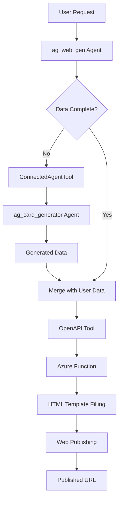

# Azure AI Foundry Agents: ConnectedAgentTool + OpenAPI Integration

This project demonstrates a production-ready implementation of modular Azure AI Foundry agents in Python, showcasing agent-to-agent communication via ConnectedAgentTool and external service integration through OpenAPI tools. The architecture emphasizes clean code, modularity, and enterprise-grade best practices.

## 🏗️ Architecture Overview

### Core Agents

#### 1. **ag_card_generator** - Business Card Data Generator
- **Location**: `agents/ag_card_generator/`
- **Purpose**: Generates creative, diverse business card data in structured JSON format
- **Pattern**: Singleton pattern for efficient resource management
- **Output**: Complete card data including title, name, city, profession, message, and date
- **Features**: 
  - International names and locations
  - Diverse professions and industries
  - Creative, professional messages
  - Consistent date formatting

#### 2. **ag_web_gen** - Web Publishing Orchestrator
- **Location**: `agents/ag_web_gen/`
- **Purpose**: End-to-end card publishing workflow with dual-tool integration
- **Tools Integration**:
  - **ConnectedAgentTool**: Connects to ag_card_generator for data generation
  - **OpenAPI Tool**: Integrates with Azure Function for HTML template processing and web publishing
- **Workflow**: Data generation → Template filling → Web publishing → URL delivery

## 🔧 Multi-Tool Architecture

### ConnectedAgentTool Implementation
```python
# Agent-to-Agent Communication
card_generator_tool = ConnectedAgentTool(
    id=card_generator_agent.id,
    name="card_generator",
    description="Generates creative business card data in JSON format with title, name, city, profession, message, and date fields"
)
```

### OpenAPI Tool Integration
```python
# External Service Integration
azure_function_tool = OpenApiTool(
    name="html_template_filler",
    description="Fills HTML template with JSON card data and publishes it to the web, returning the final URL",
    spec=openapi_spec,
    auth=OpenApiAnonymousAuthDetails()
)
```

### Tool Configuration System
The project includes a sophisticated configuration system via `openapi_azurefx_configurator.py`:

```python
# Automated OpenAPI Spec Configuration
from tools.openapi_azurefx_configurator import parse_azure_function_url_and_modify_spec

openapi_spec = parse_azure_function_url_and_modify_spec(openapi_spec_path)
```

## 🚀 Key Features & Innovations

### 1. **Intelligent OpenAPI Configuration**
- **Dynamic URL Parsing**: Automatically extracts base URL and function codes from environment variables
- **Spec Transformation**: Modifies OpenAPI specifications on-the-fly for Azure Function integration
- **Error Handling**: Comprehensive validation and error reporting

### 2. **Clean Agent Architecture**
- **Singleton Pattern**: Prevents resource duplication and ensures efficient memory usage
- **Modular Design**: Clear separation of concerns with organized folder structure
- **Reusable Components**: Agents can be easily integrated into other projects

### 3. **Production-Ready Error Handling**
- Azure authentication validation
- Network connectivity resilience
- JSON parsing and validation
- Tool execution error recovery
- Environment variable validation

### 4. **Advanced Module System**
Each agent uses Python's advanced module replacement technique for clean API:
```python
# Clean usage pattern
import ag_web_gen
agent = ag_web_gen.instance  # Auto-instantiation via property
client = ag_web_gen.client   # Shared client management
```

## 📁 Project Structure

```
agent-webmaster-py/
├── agents/
│   ├── ag_card_generator/
│   │   ├── ag_card_generator.py          # Card generator agent implementation
│   │   └── ag_card_generator_tester.py   # Interactive testing interface
│   └── ag_web_gen/
│       ├── ag_web_gen.py                 # Web generator with multi-tool integration
│       ├── ag_web_gen_tester.py          # Comprehensive testing interface
│       └── tools/
│           ├── openapi_azurefx_configurator.py     # OpenAPI configuration utility
│           └── html_template_filler_openapi_spec.json  # Azure Function API specification
├── .vscode/
│   └── settings.json                     # Development environment configuration
├── requirements.txt                      # Python dependencies
└── README.md                            # Comprehensive documentation
```

## ⚙️ Setup & Configuration

### 1. Environment Setup
```bash
# Install dependencies
pip install -r requirements.txt

# Ensure Azure CLI authentication
az login
```

### 2. Environment Variables
Create a `.env` file with the following configuration:

```env
# Azure AI Foundry Configuration
PROJECT_ENDPOINT=https://your-ai-foundry-project.cognitiveservices.azure.com/
MODEL_DEPLOYMENT_NAME=gpt-4o-mini

# Azure Function Configuration
AZURE_FUNCTION_URL=https://your-function-app.azurewebsites.net/api/FxTemplateFiller?code=your-function-code-here
```

**Note**: The `AZURE_FUNCTION_URL` should include the complete URL with the function code. The configurator will automatically parse and extract the base URL and code components.

### 3. Azure Authentication
Ensure proper Azure authentication via one of:
- Azure CLI: `az login`
- Managed Identity (for Azure-hosted applications)
- Service Principal with environment variables
- Azure PowerShell: `Connect-AzAccount`

## 🎯 Usage Examples

### Individual Agent Testing

#### Card Generator (Standalone)
```bash
# Interactive mode - prompts for input
python agents/ag_card_generator/ag_card_generator_tester.py

# Example output:
# {
#   "title": "Professional Card",
#   "name": "Sofia Chen",
#   "city": "Singapore",
#   "profession": "AI Research Scientist",
#   "message": "Passionate about developing ethical AI solutions that transform healthcare.",
#   "date": "2025-06-24"
# }
```

#### Web Generator (Full Workflow)
```bash
# Interactive mode - complete publishing workflow
python agents/ag_web_gen/ag_web_gen_tester.py

# Example workflow:
# Input: "Generate and publish a card for a teacher in Iran"
# Output: Live URL to published HTML card
```

### Integration Scenarios

#### Scenario 1: Complete Data Provided
```
User Input: "Create a card for John Smith, Software Engineer from Seattle, passionate about cloud computing"
Process: Direct JSON formatting and web publishing
Output: Published card URL with provided data
```

#### Scenario 2: Partial Data - ConnectedAgentTool Activation
```
User Input: "Create a card for Maria from Barcelona, generate missing details"
Process: 
  1. ag_web_gen receives request
  2. Identifies missing data (profession, message)
  3. Invokes ConnectedAgentTool to call ag_card_generator
  4. ag_card_generator generates missing creative details
  5. ag_web_gen publishes complete card
Output: Published card URL with mixed user/generated data
```

#### Scenario 3: Full Generation Workflow
```
User Input: "Generate and publish a card for a creative professional"
Process:
  1. ag_web_gen invokes ConnectedAgentTool
  2. ag_card_generator creates complete creative profile
  3. ag_web_gen processes data through OpenAPI tool
  4. Azure Function fills HTML template
  5. Card published to blob storage
Output: Live URL to dynamically generated card
```

## 🔄 Technical Workflow

### Agent Communication Flow


### OpenAPI Configuration Process
1. **Environment Variable Parsing**: Extract `AZURE_FUNCTION_URL`
2. **URL Component Extraction**: Separate base URL and function code
3. **Spec Loading**: Load OpenAPI specification template
4. **Dynamic Modification**: Replace placeholders and inject function parameters
5. **Tool Registration**: Create configured OpenApiTool instance

## 🛠️ Advanced Configuration

### OpenAPI Configurator Details
The `openapi_azurefx_configurator.py` provides sophisticated Azure Function integration:

```python
def parse_azure_function_url_and_modify_spec(openapi_spec_path: str) -> Dict[str, Any]:
    """
    Automatically configures OpenAPI specifications for Azure Functions
    
    Features:
    - Parses complex Azure Function URLs with authentication codes
    - Dynamically modifies OpenAPI specs with correct endpoints
    - Handles error scenarios and validation
    - Returns ready-to-use OpenAPI specifications
    """
```

### Custom Tool Development
To add new tools to the ag_web_gen agent:

1. **Create Tool Specification**: Define OpenAPI spec or ConnectedAgentTool reference
2. **Configure Tool**: Use configurator utilities for complex setups
3. **Register Tool**: Add to agent's tools list during creation
4. **Update Instructions**: Modify agent instructions to include new tool capabilities

## 🎨 Enterprise Features

### 1. **Scalable Architecture**
- Singleton pattern prevents resource waste
- Modular design supports horizontal scaling
- Clean separation enables microservice deployment

### 2. **Monitoring & Observability**
- Comprehensive error handling and logging
- Agent execution status tracking
- Tool invocation monitoring

### 3. **Security Best Practices**
- Environment variable-based configuration
- Azure authentication integration
- No hardcoded credentials or endpoints

### 4. **Developer Experience**
- Interactive testing interfaces
- Comprehensive documentation
- VS Code integration with optimized settings

## 🔍 Development Tools

### VS Code Integration
The project includes optimized VS Code settings:
```json
{
    "files.exclude": {
        "**/__pycache__": true,
        "**/*.pyc": true,
        "**/*.pyo": true
    },
    "python.defaultInterpreterPath": "./venv/bin/python"
}
```

### Testing Framework
Each agent includes comprehensive testing capabilities:
- **Interactive Testing**: Real-time agent interaction
- **Automated Validation**: JSON schema validation
- **Error Scenario Testing**: Network and authentication failure simulation

## 🚨 Troubleshooting

### Common Issues

#### ModuleNotFoundError for ag_card_generator
**Problem**: Import path configuration issue
**Solution**: Ensure `sys.path.append` is called before importing local modules

#### Azure Authentication Failures
**Problem**: Invalid or expired Azure credentials
**Solution**: Re-authenticate with `az login` or verify managed identity configuration

#### OpenAPI Tool 401 Errors
**Problem**: Incorrect Azure Function URL or expired function code
**Solution**: Verify `AZURE_FUNCTION_URL` includes valid function code parameter

#### Agent Creation Failures
**Problem**: Missing environment variables or invalid model deployment
**Solution**: Verify all required environment variables in `.env` file

### Debug Mode
Enable detailed logging by setting:
```env
AZURE_LOGGING_ENABLE=True
AZURE_LOG_LEVEL=DEBUG
```

## 🔮 Future Roadmap

### Short-term Enhancements
- [ ] Additional card templates and styling options
- [ ] Batch card generation capabilities
- [ ] Enhanced error recovery mechanisms
- [ ] Performance optimization for high-volume scenarios

### Long-term Vision
- [ ] Multi-language card support
- [ ] Advanced AI-driven design generation
- [ ] Integration with additional cloud services
- [ ] Enterprise dashboard for agent monitoring
- [ ] Plugin architecture for custom tool development

## 📊 Performance Characteristics

- **Agent Initialization**: < 2 seconds (singleton caching)
- **Card Generation**: < 1 second (average)
- **Web Publishing**: 2-4 seconds (including Azure Function processing)
- **Memory Usage**: Minimal due to singleton pattern
- **Concurrent Requests**: Scales with Azure AI Foundry service limits

## 🤝 Contributing

This project demonstrates production-ready patterns for Azure AI Foundry agent development. The architecture serves as a foundation for building complex, multi-agent systems with external service integration.

### Key Learning Outcomes
- ConnectedAgentTool implementation for agent communication
- OpenAPI tool integration with Azure Functions
- Advanced Python module patterns for clean APIs
- Production-ready error handling and configuration management
- Scalable agent architecture design patterns

---

**Built with Azure AI Foundry SDK** | **Python 3.9+** | **Enterprise-Ready Architecture**
